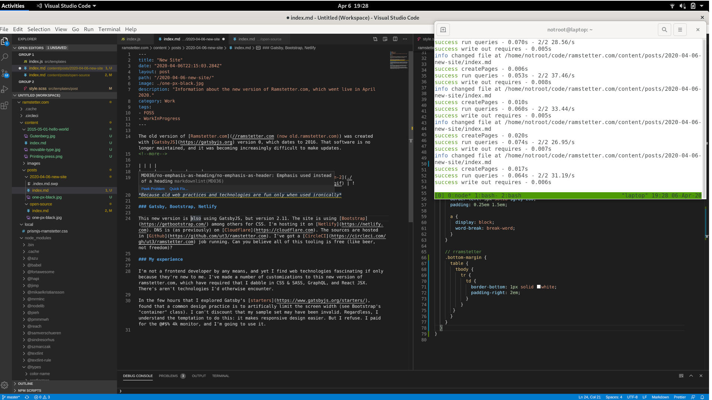

The old version of [Ramstetter.com](//ramstetter.com (now old.ramstetter.com)) was created with [GatsbyJS](https://gatsbyjs.org) version 0, which dates to 2016. That software is no longer maintained, and it was becoming increasingly difficult to make updates.
<!--more-->

| | | |
| --- | --- | --- | --- |
|  |  |  |  |
*Because old web practices and technologies are fun only when used ironically*

### Gatsby, Bootstrap, Netlify

This new version is also using GatsbyJS, but version 2.11. The site is using [Bootstrap](https://getbootstrap.com/) among others for CSS. I'm hosting it on [Netlify](https://netlify.com). DNS is (as previously) on [Cloudflare](https://cloudflare.com). The sources are hosted in [Github](https://github.com/ut3/ramstetter.com). I've got a [CircleCI](https://circleci.com/gh/ut3/ramstetter.com) job running. Can you believe all of this tooling is free (like beer, not freedom)?

### My experience

I'm not a frontend developer by any means, and yet I find web technologies fascinating if only because they're new to me. I've made a number of customizations to this new version of ramstetter.com, which have required that I dabble in CSS & SASS, GraphQL, and React JSX. There's aren't technologies I'd otherwise encounter.

In the few hours that I explored Gatsby's [starters](https://www.gatsbyjs.org/starters/), I found that a common design practice is to artificially limit the screen width (see Bootstrap's "container" class). I can't discount that my sample set may have been invalid. Regardless, I understand the temptation to do this: it makes responsive design easier. But I refuse. I paid for the @#$% 4k monitor, and I'm going to use it.

Here's a screenshot of me editing this page in [Visual Studio Code (vscode)](https://code.visualstudio.com/):

